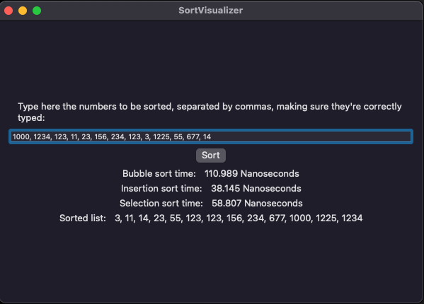

# Sort Visualizer

A simple MacOS app that sorts the user input using three different sort algorithms: bubble sort, selection sort, and insertion sort. It also computes the time of each sort operation.

# Screenshots

