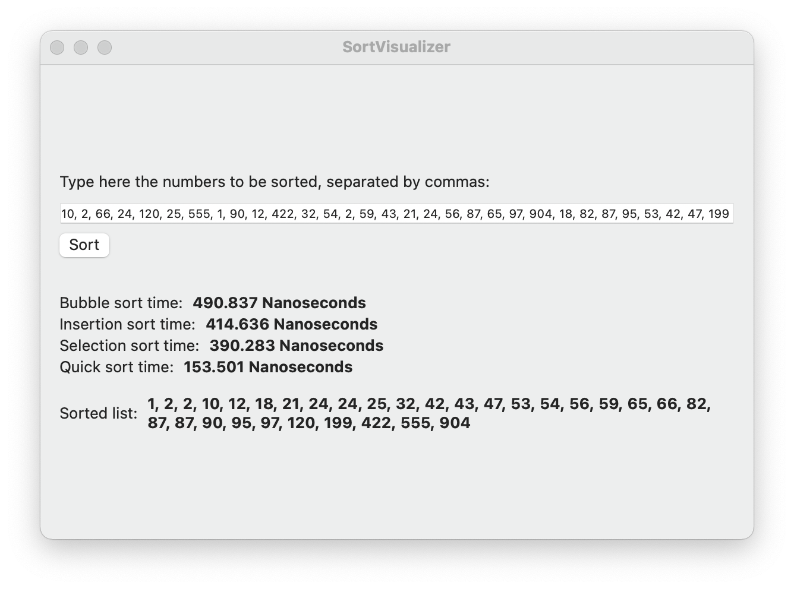

# Sort Visualizer

An app that performs empirical tests on different sorting algorithms, displaying the time each one took to sort the entered list of numbers.

## Covered sorting algorithms

- Bubble sort
- Insertion sort
- Selection sort
- Quick sort
- Merge sort [TODO]

## Screenshots

